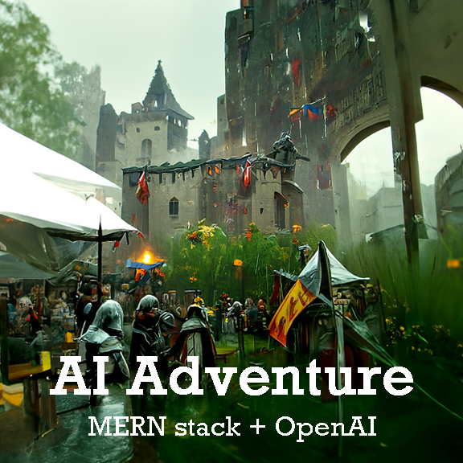
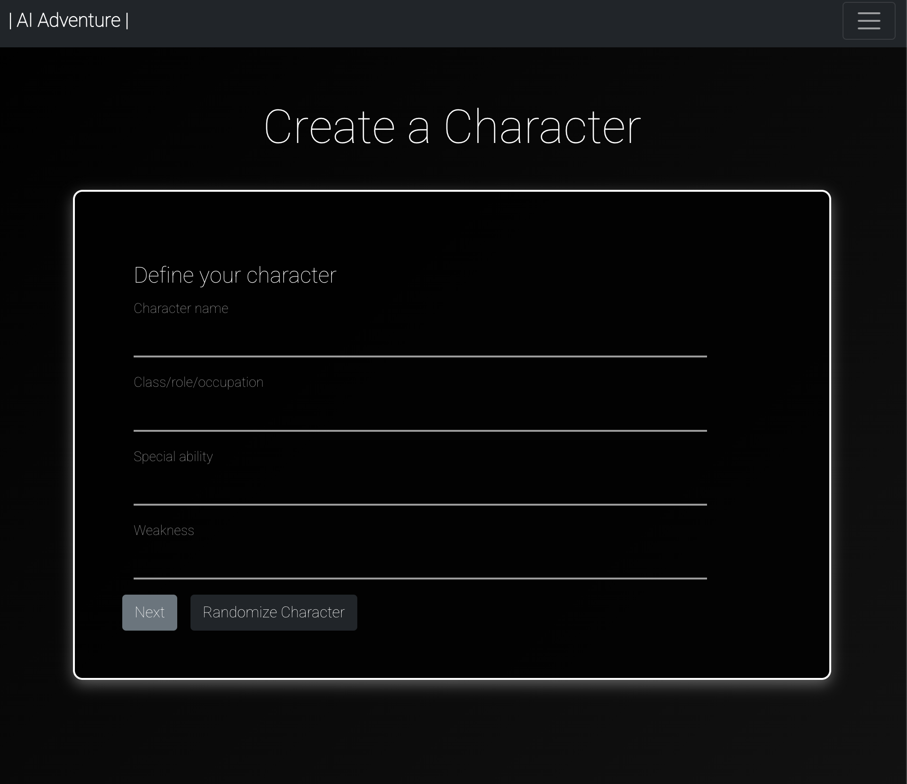
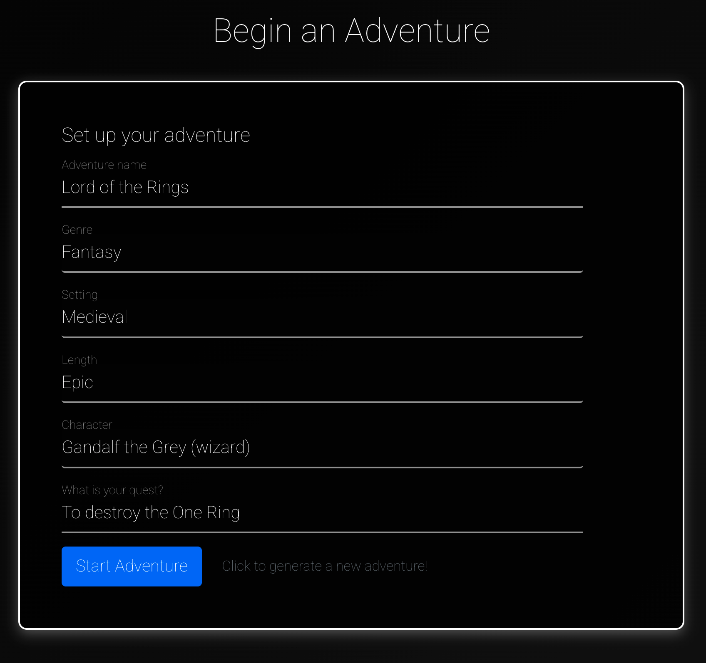
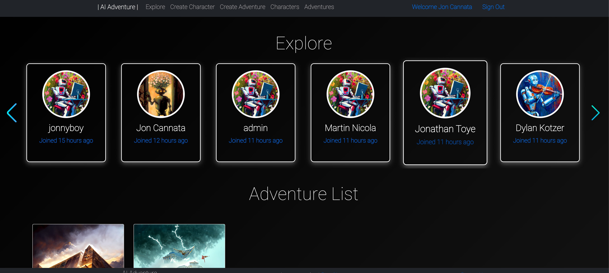
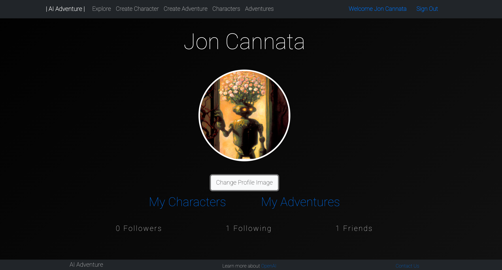

# AI Adventure

## Project Team

[Jon Toye](https://github.com/jontoye) 
[Dylan Kotzer](https://github.com/DKotzer) 
[Camiel van Schoonhoven](https://github.com/Runite-Drill) 
[Jon Cannata](https://github.com/cannatajon) 

This app was created in ten days as the final project for [General Assembly](https://generalassemb.ly/)'s Software Engineering Immersive. Supporting development has continued thereafter.

## Getting Started

AI Adventure is a “Choose Your Own Adventure” game in which users can create characters, choose a storyline, and follow prompts to continue down a story path. Stories are newly generated by utilizing OpenAI API with Davinci engine. Using this API allows the user a multitude of different storylines for continuous engagement.

[See it here](https://aiventure.herokuapp.com/)

To get started, users sign up for an account (or sign in with Google)

<small>Main Page</small>

 

## Creating a Character

To create a character, go to 'Create Character' and fill in the required form, or let the Randomize Character button do it for you! You will then need to come up with a backstory for your character, or you can ask the AI to write one for you.

<small>Create a Character page</small>

## Creating an Adventure

To create an Adventure, go to 'Create Adventure', or click "Start Adventure" from the character's page and fill in the required form. Upon beggining the adventurer the AI will spend a little bit of time thinking up a great story for you to play through!

<small>Create an Adventure page</small>

## Adventure Gameplay

Once you start an adventure, or continue a saved adventure, you will begin your adventure! AI Adventure is a text-based choose-your-own adventure game, so gameplay consists of reading through a short story and selecting one of the options provided to you by the AI. Once you select an option the AI will begin thinking about where to take your story next!

<small>AI Adventure Gameplay</small>

## Explore

Navigate to the 'Explore' page to view:

<ul>
<li>Users who you can follow and add to your friends list</li>
<li>All of your created adventures</li>
<li>All of your created users</li>
</ul>

<small>Explore page</small>

 

## Profile page

Your profile page contains links to your characters and adventures, as well as a follower/friend counter. 
Also included is an editable "About me" section and activity log

<small>Profile page</small>

 

## Technologies

This project was built with HTML, CSS, JavaScript, Bootsrap, MongoDB, Express.js, React, Node.js, NoSQL, and deployed with Heroku. 
AI technology by OpenAI, utilizing the Davinci text engine. 
All artwork is AI-generated using Disco Diffusion.

## Next Steps

Future releases of AI Adventure will include:

<ul>
    <li>Bug fixes and stability improvements</li>
    <li>Firefox and Safari optimization</li>
    <li>AI-generated end-point for an Adventure</li>
    <li>Utilise dallE-2 AI for image generation
    <li>Gender-diverse character images and generation</li>
    <li>Inventory system</li>
    <li>Complete implementation of achievements</li>
    <li>Journal/scrap to read through completed adventures</li>
    <li>Epic Bard poems</li>
    <li>Localise characters and adventures to their user --DONE</li>
    <li>Dynamic image generation</li>
    <li>Improved AI and option parsing</li>
    <li>Sound effects and music</li>
</ul>
